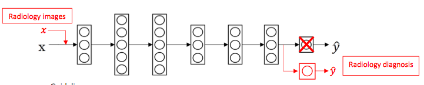
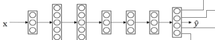

## Transfer Learning

> Transfer learning refers to using the neural network knowledge for another application.

### When to Use Transfer Learning

- Task A and B have the same input x
- A lot more data for Task A than Task B
- Low level features from Task A could be helpful for Task B

The guideline is 

- delete last layer of neural network (the output layer)
- delete weights feeding into the last output layer of the neural network
- create a new set of random initialized weights for the last layer only
- new data set (x, y)

## Multi-task Learning

> Multi-task learning refers to having one neural network do simultaneously several tasks.

### When to Use Multi-task Learning

- Traning on a set of tasks taht could benefit from having shared lower-level features
- Usually: Amount of data you have for each task is quite similar
- Can train a big enough neural network to do well on all tasks

### Neural Network Architecture

### Loss Function

$$
\ell (\hat{y}^{(i)}, y^{(i)}) = - \frac{1}{m}{\sum_{i=1}^{m}\sum_{j=1}^{n_y}(y_j^{(i)}\log{\hat{y}_j^{(i)}}+(1-y_j^{(i)})\log{1-\hat{y}_j^{(i)}})}
$$

